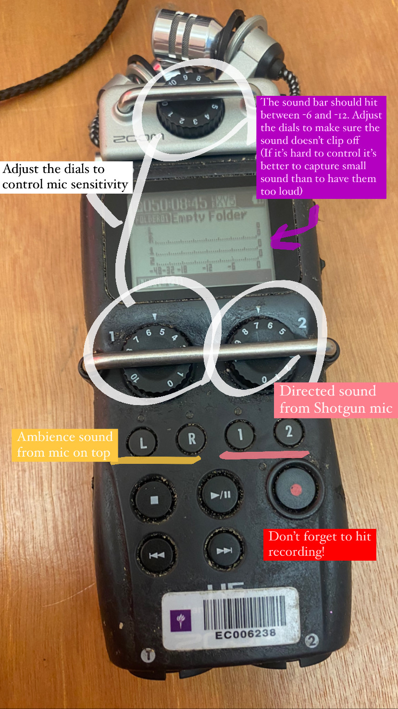
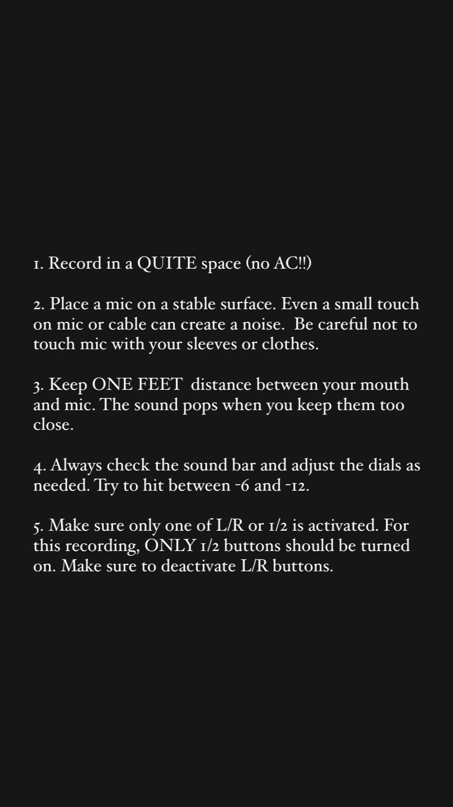

# InternalRecording_AlexaN1978384.wav #
## Project Description ##
Have you ever lost someone close? 

This project captures the emotions--**depression, loneliness, denial, and many more**--of dealing with a loss. 

The character goes through a loss of her brother Bilal. It includes an element of surprise as it does not tell the audience any context in the beginning. As a user listens to the internal recordings of Alexa on different dates, however, he or she slowly understands what the chracter is going through and finally sees the clear picture at the end after listening to the lawyer's voicemail. 

## Process ##
### Phase 1: Sound Collection ###
We used three types of sounds in this project.
- we downloaded some **sound effects** from Internet sources
- we used **AI voice generator**
- we recorded the voice of the main character with the **audio equipment**. 

As I had a previous experience with the Arts booking system, I was in charge of renting the equipment and explaining how to use the equipment to other team members. Below are the photos I shared with my team members. (Feel free to share them with future students of Communications Lab if needed!)

  

### Phase 2: Sound Design ### 
After receiving audio files from team members, I used **Davinci Resolve** to work on the sound design. I used Davinci Resolve instead of Audacity because I already had some experience with the program. 

To create a continuity in the audio space, I picked up **ambient noise** from the sounds recorded by Insiya. The ambient noise was put in places that lacked background noise such as Alexa's voice. 

One other feature I paid attention to is the **voicemail in the last scene**. To make it sound more like an actual voicemail recorded on phone, I played with pitches and distortion. I am very satisfied with the result and I think it contributed to creating an authentic experience for the audience. 

### Phase 3: Website ###
The finished sound design was exported as four separate wave files, each being the sounds of each scene. After we settled with the website design through Google Slides, I used **html, css, and javascript** to create a scrolling website that plays each sound when different items are clicked. 

The background, title, and the instructions are fixed. When a user scrolls down the website, new Alexas and the dates appear. I used **position relative** to connect the position of Alexas and their dates when scrolling. **EventListener** and **.play()** function were used to play sounds of each scene when a user clicks different Alexas. 

## Reflection and Evaluation ##
I think most of our goals were met with the final website. From the sound itself to the website design, our final presentation is very similar with what we invisioned in the first meeting. I am highly satisfied with what we achieved and already excited for the next assignment! 
